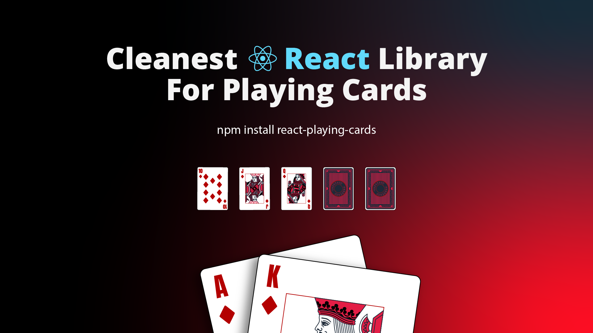

# React Playing Cards Components




A React component library for rendering playing cards with custom SVG designs.

## Installation

```bash
npm install @yojda/react-playing-cards
```

## Usage

```tsx
import { Card } from 'react-playing-cards';

export default function App() {
  return (
    <Card
      suit="h"
      rank="A"
      variant="primary"
      width={200}
    />
  );
}
```

## Props

| Prop | Type | Default | Description |
|------|------|---------|-------------|
| `suit` | `"h" \| "d" \| "c" \| "s"` | — | Card suit (hearts, diamonds, clubs, spades) |
| `rank` | `"2"–"9" \| "T" \| "J" \| "Q" \| "K" \| "A"` | — | Card rank |
| `variant` | `"primary" \| "secondary" \| "tertiary" \| "quaternary"` | `"primary"` | Card design variant |
| `width` | `number` | `200` | Width in pixels |
| `className` | `string` | `""` | Additional CSS class |

## Variants

The library ships four visual variants of each card — `primary`, `secondary`, `tertiary`, and `quaternary` — each with its own SVG design.

## Development

```bash
# Install dependencies
npm install

# Start Storybook
npm run storybook

# Build the library
npm run build
```

## Webpack / SVGR

This library uses SVG files as React components via `@svgr/webpack`. If you're consuming this library in a webpack project and importing SVGs directly, make sure SVGR is configured in your webpack setup.

For Storybook, add this to `.storybook/main.ts`:

```ts
webpackFinal: async (config) => {
  config.module!.rules!.push({
    test: /\.svg$/i,
    use: [{ loader: "@svgr/webpack", options: { exportType: "default" } }],
  });
  return config;
},
```

## License

MIT